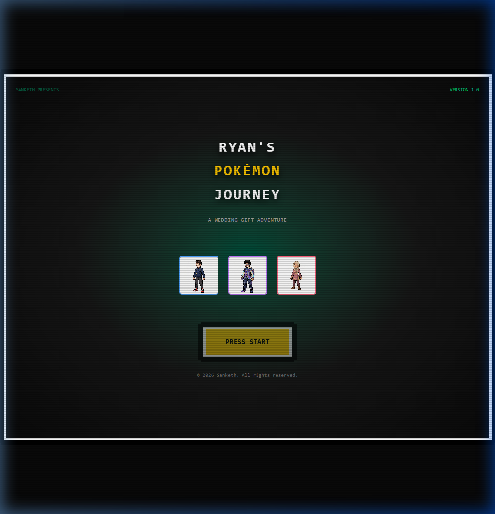
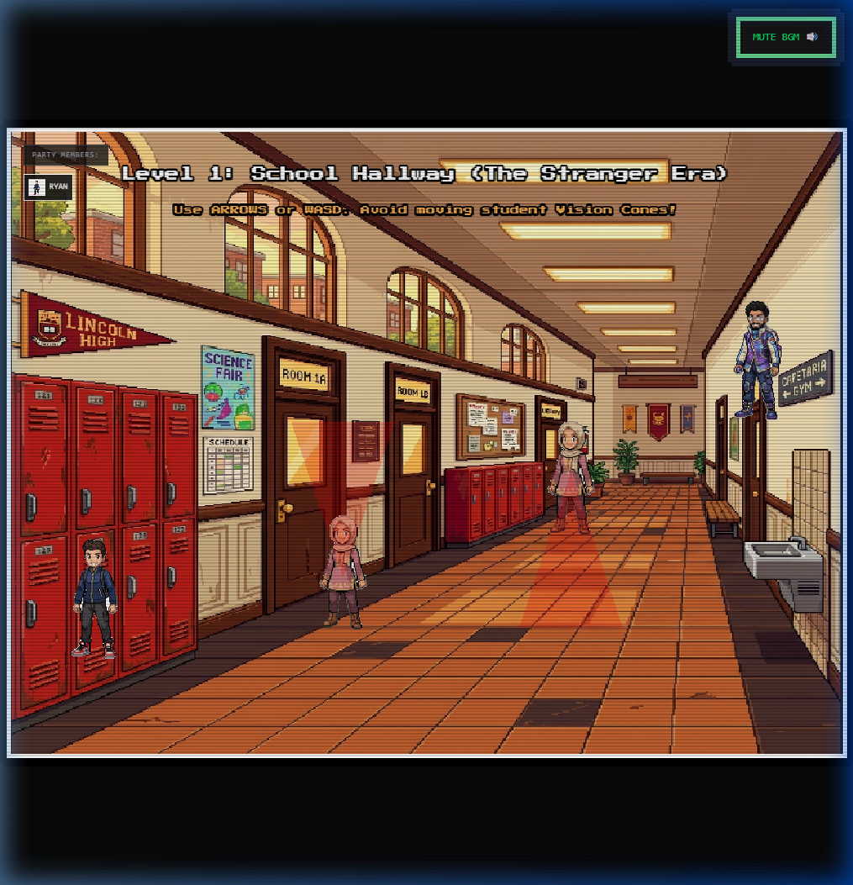
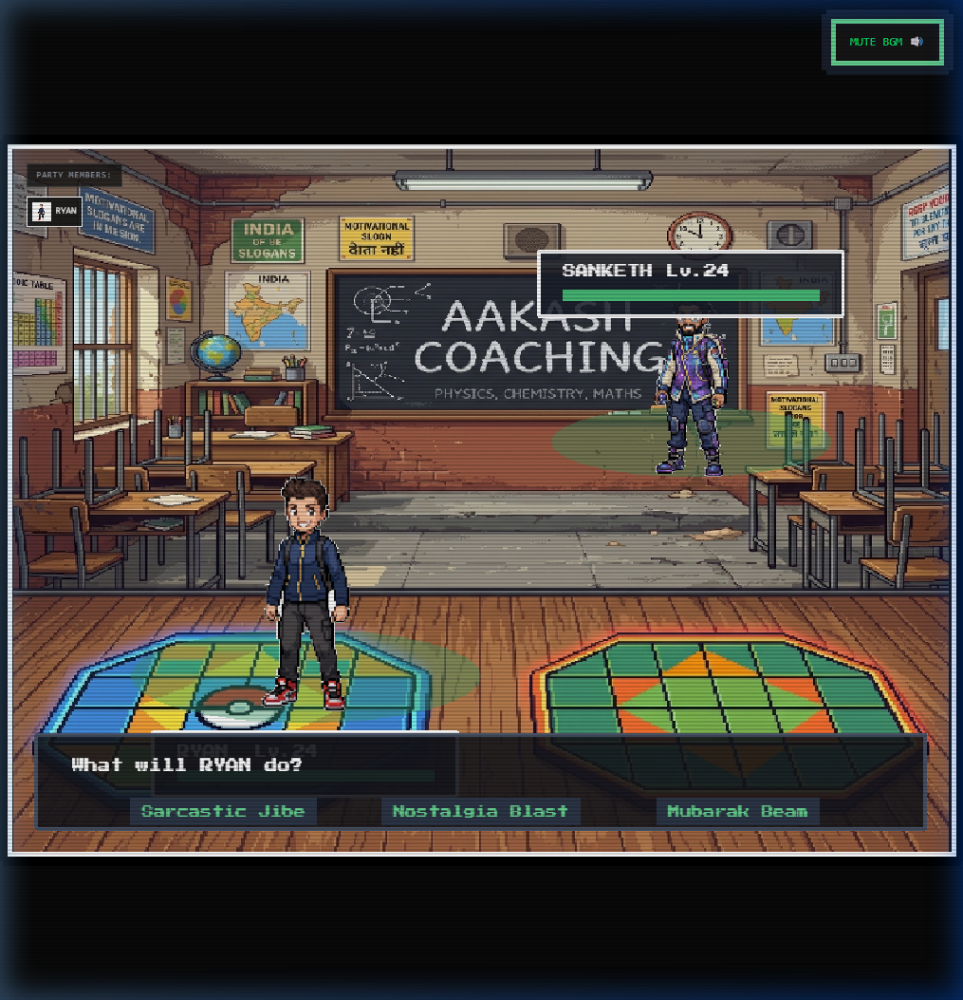
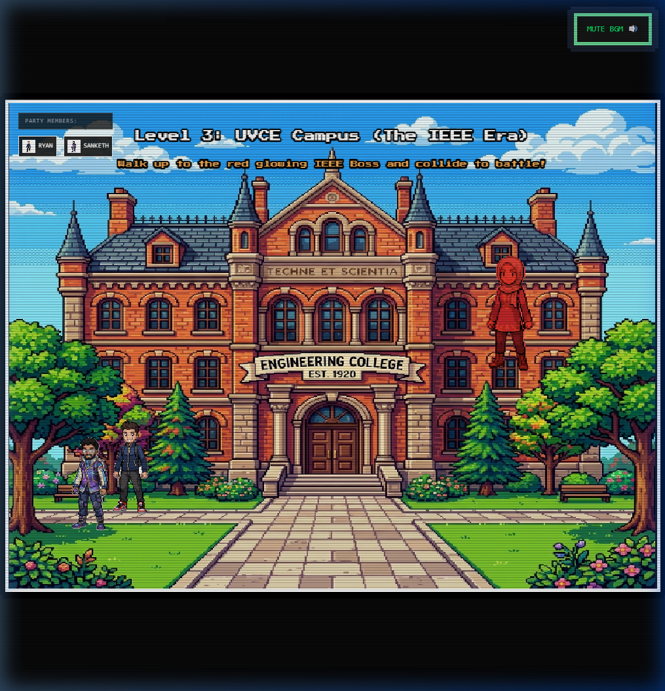

# Walkthrough: Ryan's Pokémon Journey (Wedding Gift Game)

This walkthrough documents the full implementation of the interactive, 16-bit GBA-era Pokémon-style web application built as a personalized wedding gift for **Ryan Sailani** from his close friend **Sanketh**.

The game is fully completed, built, and playable in your browser from Level 1 through the Ending!

---

## 🚀 How to Run the Game Locally

1. **Install Dependencies:**
   Run the following command in the project root:
   ```bash
   npm install
   ```

2. **Start the Development Server:**
   Run the local development server:
   ```bash
   npm run dev
   ```

3. **Play in Browser:**
   Open the URL shown in your terminal (usually `http://localhost:5173/`).
   *Note: Click anywhere on the screen first to enable the sound synthesizer to play the nostalgic chiptunes.*

---

## 🎮 Playable Game Flow & Narrative Arc

### 1. Retro Title Screen
Presents a Game Boy Advance style start screen. It displays the custom character pixel art models for **Ryan**, **Sanketh**, and **Anam**. Clicking **PRESS START** boots the first overworld scene and starts playing the upbeat overworld town theme.



### 2. Level 1: School Hallway (The Stranger Era)
- **Controls:** Walk using **ARROW KEYS** or **WASD**. The characters scale proportionally and look large, detailed, and clear on the overworld canvas.
- **Stealth Puzzle:** Guide Ryan through the crowded hallway. NPC students patrol up and down, projecting red vision cones. Getting spotted triggers a `!` alert and sends Ryan back to the start.
- **Objective:** Reach Sanketh standing on the far right. Touch him to trigger dialogue and enter Level 2.
- **Bobbing Animation:** Features a gentle walking hop that alters origin offsets, ensuring smooth movements without locking the down arrow.



### 3. Level 2: Aakash Coaching (The Battle Era)
- **Transition:** Lock eyes with Sanketh to trigger a Pokémon-style battle transition screen.
- **Battle Mechanics:** Turn-based battle (Ryan vs Sanketh) featuring HP bars, damage shake/flash animations, and a customized moves list.
  - **Sarcastic Jibe:** Dealt solid effective damage.
  - **Nostalgia Blast:** Old memories strike emotional damage.
  - **Mubarak Beam:** Ultimate finishing beam!
- **Objective:** Defeat Sanketh in the duel. Upon defeat, he officially joins your overworld party.



### 4. Level 3: UVCE Campus (The IEEE Boss Fight)
- **Overworld:** Walk together with Sanketh on the UVCE Engineering College campus map.
- **Objective:** Find the red glowing **IEEE Boss** and touch him to trigger a Co-op Battle.
- **Co-op Mechanics:** Face the boss with Ryan and Sanketh. Ryan can cast *Grit Shield* (heals team/increases defense) while Sanketh uses *Data Surge* (high cosmic damage) to claim victory.



### 5. Level 4: SAP Labs & Kalyan Nagar Café (The Corporate Loop)
- **Scripted Wipeout:** Face the *SAP Outage Boss* in the lobby. The boss casts a scripted wipeout attack dealing 999 damage. Fades to black with the text: *"Stamina too low! Go refresh at Kalyan Nagar!"*
- **Café Refill Loop:** Transitions to Kalyan Nagar Café overworld. Walk to the barista counter and drink a *Special Espresso Brew* to fully restore HP and Stamina.
- **Shield Bypass & Anam's Recruitment:** Return to SAP Labs. The boss has an active *Unresolved Bug Shield* (immune to damage). Walk back to the lobby, interact with **Anam**, and recruit her. She joins your party and uses *Clutch Assist* to shatter the shield, allowing Ryan's Mubarak Beam to deal the winning hit!

### 6. Ending: Sunset Crossroads (Farewell Cutscene)
- Transitions to a gorgeous sunset route split.
- Ryan and Sanketh walk to the center and have their emotional Ash/Brock farewell dialogues.
- They do a pixel high-five, turn, and walk away down separate paths.
- A **Golden Pokéball** falls from the sky, bounces, and sparkles. Clicking the ball opens the final congratulatory card overlay (Mubarak Oye Mubarak!) with falling pixel confetti.

---

## 🛠️ Key Technical Implementations

1. **Pixel Background Transparent Keyer:**
   Created an automated flood-fill background removal utility in the boot scene. It automatically removes the white backgrounds from character images on-the-fly and crops them to their bounding boxes, allowing seamless overworld integration.

2. **Web Audio Synthesizer:**
   Created a native, zero-asset audio synth in TypeScript that programmatically generates 8-bit sound effects (ticks, hits, level-up fanfares) and BGM loop tracks using oscillator nodes. No external audio assets are needed.
